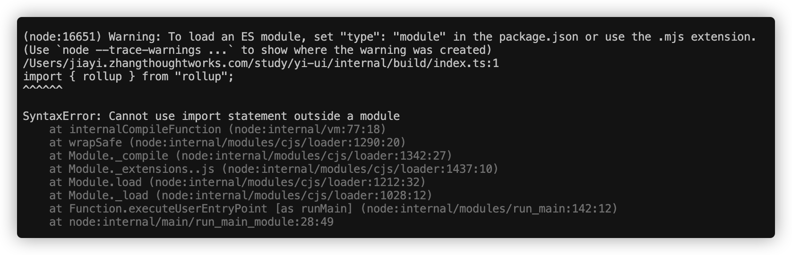
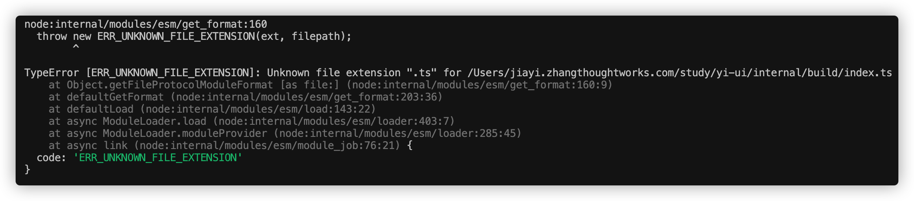
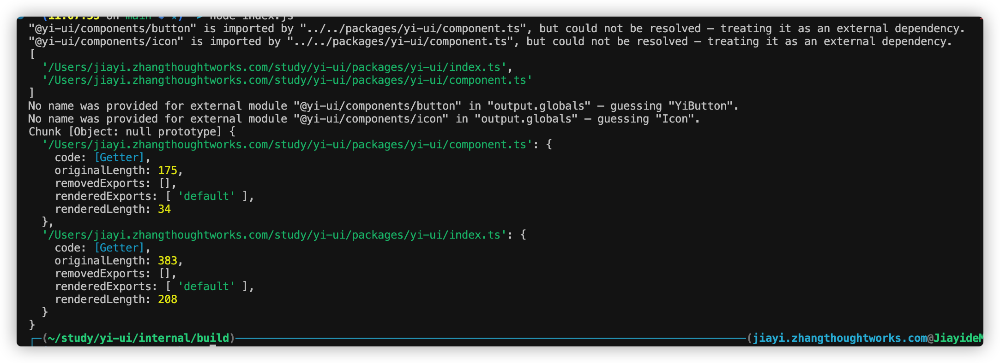
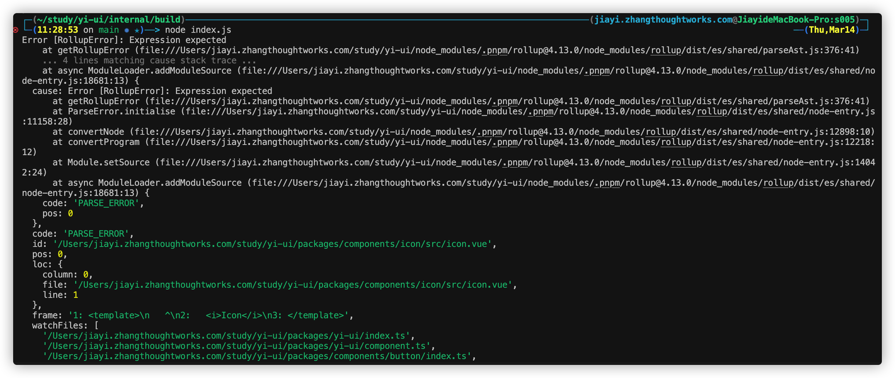
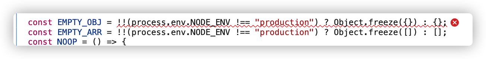
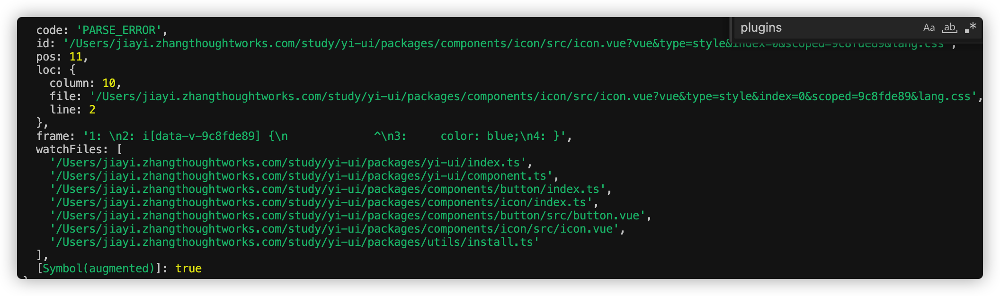

# 学习路程记录

# 0. 安装PNPM
npm i -g pnpm
npm init

# 1. 初始化
1. 创建 .gitignore 
2. 创建 .npmrc (pnpm相关配置)
3. 创建 pnpm-workspace.yaml (定义了 工作空间 的根目录，并能够使您从工作空间中包含 / 排除目录 。 默认情况下，包含所有子目录。)

# 2. 安装并配置全局依赖
pnpm add -D typescript ts-node -w

# 3. 安装play项目
pnpm create vite

# 4. 测试
1. 创建 test 文件夹，目录结构如下
- test
    - index.ts
    - package.json

2. 进入到Yi-Ui/play
使用 pnpm add @yi-ui/test
在 src/App.vue, 引入并使用即可
import { sayHi } from "@yi-ui/test"
sayHi('Jia yi')

运行

# 5. 安装vitePress
https://vitepress.dev/zh/guide/getting-started

# 6. 创建组件

# 7. 打包
打包错误总结
第一：set "type": "module" in the package.json

第二：编译ts rollup-plugin-esbuild 

第三：@rollup/plugin-node-resolve

第四：@vitejs/plugin-vue 

第五：@rollup/plugin-replace

第六：rollup-plugin-css-only
